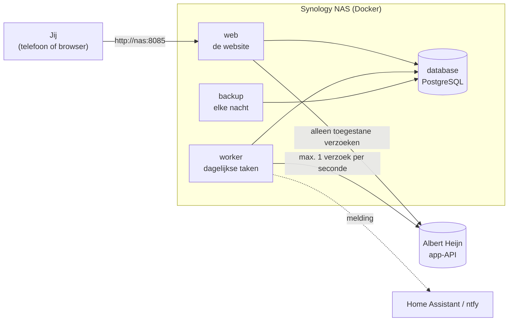

# Kruidenier

**Je eigen kruidenier die weet wat er op raakt.** Kruidenier draait thuis op een Synology NAS,
kijkt naar wat je bij Albert Heijn online bestelt, rekent uit hoe snel je dingen opmaakt en
zet een voorstel klaar voor je volgende AH-bezorging. Met één druk op de knop staat dat
voorstel in je AH-bestelling. Afrekenen doe je altijd zelf in de AH-app.

> Kruidenier gebruikt de **onofficiële** app-API van Albert Heijn. AH kan die zonder
> aankondiging veranderen. Kruidenier is daarom zo gebouwd dat het bij twijfel niets doet
> en je een melding stuurt. Het is een persoonlijk project, geen product van AH.

## Wat het doet

- **Deze week:** een voorstel voor je volgende levering. Per product zie je waarom het erin
  staat ("Voorraad op rond vr 9-10") en kun je het aantal aanpassen met − en +.
- **Zet in mijn AH-bestelling:** Kruidenier zet het voorstel in je echte AH-bestelling. Het
  haalt nooit iets weg wat jij er zelf in zette, en je kunt alles terugdraaien.
- **Vaak gekocht:** wat je regelmatig koopt maar nu niet in het voorstel staat.
- **Bonus:** aanbiedingen van deze week, eerst van producten die jij koopt en daarna van
  vergelijkbare producten.
- **Families:** groepen producten die voor jou hetzelfde zijn, zoals verschillende pakken
  halfvolle melk. Die kun je samenvoegen, splitsen of uitsluiten.
- **Leert van je:** knoppen als "meer", "minder", "nog genoeg" en "niet meer" passen het
  model aan.
- **Prijshistorie:** elke dag worden de prijzen van jouw producten bewaard. AH bewaart dat
  nergens, en het is nodig om later te kunnen zien of een aanbieding echt voordelig is.
- **Automatisch (optioneel):** zet de zekere producten zelf in je bestelling, een vast
  aantal uur voor de sluitingstijd. Staat standaard uit.

## Waar begin je?

| Je wilt... | Lees |
|---|---|
| Kruidenier installeren op je NAS | [docs/install-synology.md](docs/install-synology.md) |
| Weten wat elk scherm en elke knop doet | [docs/gebruik.md](docs/gebruik.md) |
| Begrijpen hoe het in elkaar zit | [docs/architectuur.md](docs/architectuur.md) |
| Begrijpen hoe het voorstel wordt berekend | [docs/hoe-kruidenier-rekent.md](docs/hoe-kruidenier-rekent.md) |
| Weten waarom iets zo gebouwd is | [docs/keuzes.md](docs/keuzes.md) |
| Zelf aan de code werken | [docs/ontwikkelen.md](docs/ontwikkelen.md) |
| Weten wat we over de AH-API hebben uitgezocht | [docs/ah-api.md](docs/ah-api.md) |
| De oorspronkelijke wensen en plannen | [SPEC.md](SPEC.md) |

## Hoe het ongeveer werkt

Elke ochtend haalt de **worker** je nieuwe bezorgde bestellingen op, rekent het verbruik
opnieuw uit, logt de prijzen en maakt het voorstel. De **web**-container toont dat aan jou en
voert jouw knoppen uit. Alles staat in een eigen **database** op je NAS. Er gaat niets naar de
cloud, behalve de verzoeken aan AH zelf.

## Stand van zaken

| Fase | Wat | Status |
|---|---|---|
| 0 | De AH-API onderzoeken (spike) | ✅ klaar, zie [docs/ah-api.md](docs/ah-api.md) |
| 1 | Historie, verbruiksmodel, voorstel, prijslogger, web-UI, Docker | ✅ klaar |
| 2 | Voorstel in de AH-bestelling zetten, terugdraaien, automatisch | ✅ gebouwd, automatisch staat uit |
| 3 | Echte korting beoordelen met je prijshistorie | ⏳ heeft eerst 4-6 weken prijsdata nodig |
| 4 | Bulk inslaan als iets echt goedkoop is | ⏳ |
| 5 | Maaltijdplanning | ⏳ |

## De belangrijkste spelregels

Deze regels staan in [CLAUDE.md](CLAUDE.md) en worden in de code afgedwongen:

1. **Nooit afrekenen of betalen.** Kruidenier kan alleen de AH-verzoeken doen die op een
   vaste lijst staan (de *allowlist*), en afrekenen staat daar bewust niet op.
2. **Tests praten nooit met de echte AH.** Ze gebruiken opgenomen antwoorden (*fixtures*).
3. **Rustig aan met AH:** maximaal ongeveer één verzoek per seconde, nooit verzoeken tegelijk.
4. **Bij twijfel niets doen:** klopt een antwoord van AH niet met wat we verwachten, dan
   stopt Kruidenier en stuurt het een melding.
5. **Geen geheimen in git:** wachtwoorden en sleutels staan alleen in `.env` op de NAS.
6. **Alles is terug te draaien:** elke wijziging in je AH-bestelling wordt vastgelegd.
7. **Geen AI in het bestelpad:** het voorstel komt uit gewone, testbare rekenregels.

## Begrippenlijst

| Begrip | Betekenis |
|---|---|
| **API** | De "achterdeur" waarmee programma's met elkaar praten. De AH-app gebruikt er een; Kruidenier praat met dezelfde. |
| **Adapter** | Het enige stuk code dat weet hoe AH werkt (`app/ah`). Verandert AH iets, dan hoeft alleen dit stuk aangepast. |
| **Allowlist** | De vaste lijst van AH-verzoeken die Kruidenier mag doen. Alles daarbuiten wordt geweigerd. |
| **Container / image** | Een *image* is een ingepakt programma met alles erbij; een *container* is zo'n image dat draait. Kruidenier is één image dat als `web` en als `worker` draait. |
| **Cutoff / sluitingstijd** | Het laatste moment waarop je een AH-bestelling nog kunt aanpassen. |
| **Familie** | Een groep producten die voor jou uitwisselbaar zijn ("halfvolle melk"). Het verbruik wordt per familie berekend. |
| **Fixture** | Een opgeslagen echt antwoord van AH, waarmee de tests werken. |
| **Heropenen** | Een bevestigde AH-bestelling weer bewerkbaar maken. De AH-app doet dat ook als je iets wijzigt. |
| **Migratie** | Een script dat de structuur van de database bijwerkt naar een nieuwe versie. Draait vanzelf bij het opstarten. |
| **Tier** | Hoe zeker een regel is: `auto` (mag automatisch) of `propose` (alleen voorstellen). |
| **Verbruik** | Hoeveel je per dag opmaakt, bijvoorbeeld 285 ml melk per dag. |
| **Worker** | Het deel van Kruidenier dat op vaste tijden taken uitvoert, zonder dat jij iets doet. |

## Licentie en verantwoordelijkheid

Gebruik op eigen risico. Kruidenier doet zijn best je bestelling niet te verstoren (zie
[docs/keuzes.md](docs/keuzes.md)), maar controleer je AH-bestelling altijd voordat je
afrekent.
