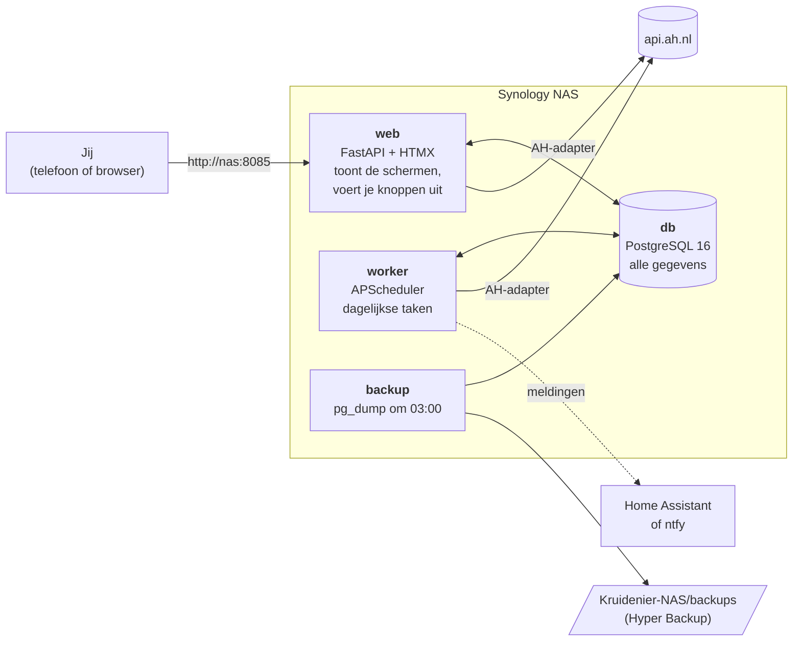
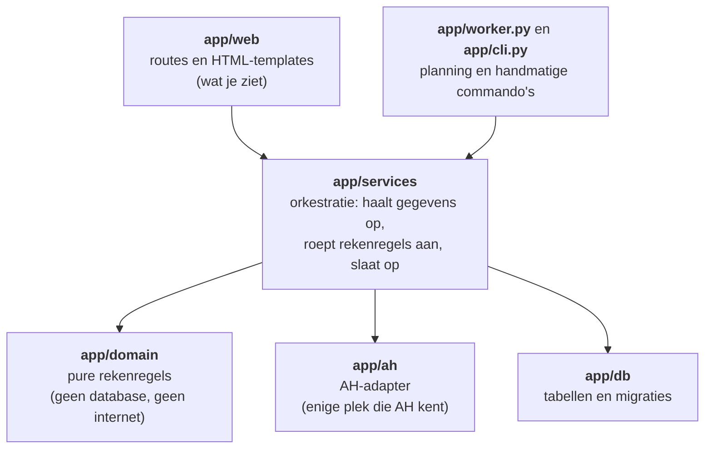
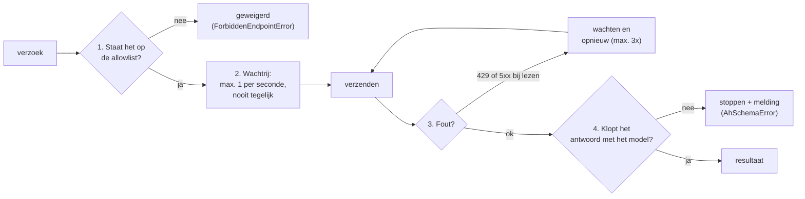
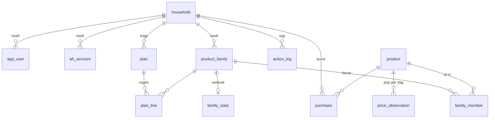
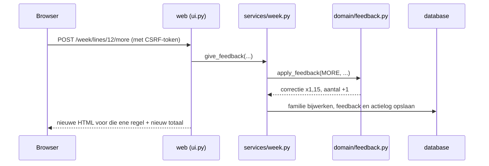
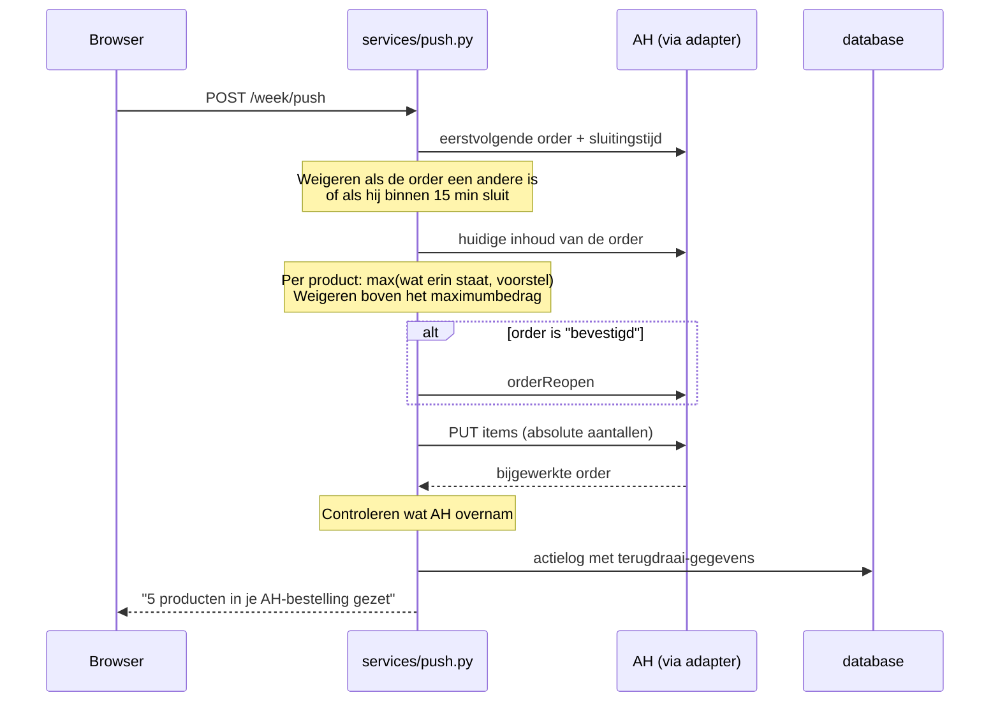
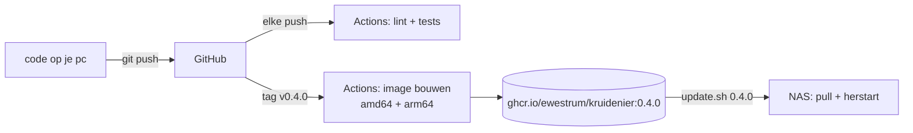

# Architectuur

Dit document legt uit hoe Kruidenier in elkaar zit: welke onderdelen er zijn, wat ze doen,
hoe ze met elkaar praten en waar je in de code moet kijken. Je hebt geen voorkennis nodig;
onbekende woorden staan in de [begrippenlijst in de README](../README.md#begrippenlijst).
Waarom het zo gebouwd is, staat in [keuzes.md](keuzes.md).

## 1. Het grote plaatje

Kruidenier bestaat uit vier **containers** die samen op je NAS draaien. Docker Compose
(in Synology: Container Manager) start ze samen als één "project".

| Container | Wat het doet | Waar de code staat |
|---|---|---|
| `web` | De website. Draait bij het opstarten eerst de databasemigraties. | `app/web/` |
| `worker` | Voert op vaste tijden taken uit (zie §4) en schrijft elke minuut een "hartslag". | `app/worker.py` |
| `db` | PostgreSQL-database. De bestanden staan in `Kruidenier-NAS/db` op de NAS. | (standaard image) |
| `backup` | Maakt elke nacht een databasedump en bewaart er 14. | `scripts/backup.sh` |

`web` en `worker` zijn **hetzelfde image** met een ander startcommando
(`scripts/entrypoint.sh`). Zo is er maar één ding om te bouwen en bij te werken.

## 2. De code in lagen

De code is opgedeeld in lagen. Elke laag mag alleen de laag eronder gebruiken. Daardoor kun
je de rekenregels testen zonder database, en de AH-koppeling vervangen zonder de rest aan te
raken.

| Map | Inhoud | Belangrijkste bestanden |
|---|---|---|
| `app/domain/` | Rekenregels als pure functies: gegevens erin, beslissing eruit. | `consumption.py` (verbruik), `planning.py` (wel/niet in voorstel, hoeveel), `tiers.py` (automatisch of voorstellen), `feedback.py` (wat een knop doet), `order_changes.py` (wat naar AH gaat en hoe terugdraaien werkt), `units.py` (verpakkingsgroottes lezen), `families.py` (families voorstellen) |
| `app/ah/` | De AH-adapter. | `client.py`, `allowlist.py`, `models.py`, `ratelimit.py`, `token_crypto.py`, `errors.py` |
| `app/services/` | Het werk dat meerdere lagen combineert. | `sync.py` (dagelijkse taken), `history.py` (orders importeren), `planner.py` (statistiek en voorstel), `prices.py`, `bonus.py`, `push.py` (naar AH-bestelling), `autopilot.py`, `week.py` (scherm Deze week), `family_admin.py`, `household_admin.py`, `users.py`, `notify.py`, `accounts.py` |
| `app/db/` | Databasetabellen (SQLAlchemy) en migraties (Alembic). | `models.py`, `migrations/versions/` |
| `app/web/` | De website. | `ui.py` (alle schermen), `deps.py` (inloggen, beveiliging), `templates/`, `static/` |
| `tests/` | Tests per laag, met dezelfde indeling. | `fixtures/ah/` bevat opgenomen AH-antwoorden |
| `scripts/` | Hulpscripts. | `probe.py` (AH verkennen, handmatig), `entrypoint.sh`, `backup.sh`, `update.sh`, `plan.sql` |

## 3. De AH-adapter: vier lagen bescherming

Elk verzoek naar AH gaat door één functie (`HttpAhClient._send` in `app/ah/client.py`).
Daar zit de bescherming, in deze volgorde:

1. **Allowlist** (`allowlist.py`). Alleen de verzoeken die in de spike zijn onderzocht, staan
   erop. Woorden als `checkout`, `payment`, `submit` en `confirm` worden altijd geweigerd.
   GraphQL-verzoeken kunnen alleen uit een vaste lijst teksten komen.
2. **Wachtrij** (`ratelimit.py`). Eén verzoek tegelijk, minstens 1 seconde ertussen, gedeeld
   door alle onderdelen in hetzelfde proces.
3. **Opnieuw proberen**. Bij "te veel verzoeken" (429) of een serverfout bij *lezen* wordt
   gewacht en opnieuw geprobeerd. Een *schrijfactie* wordt na een serverfout **niet**
   herhaald: dan weten we niet of hij gelukt is.
4. **Controle van het antwoord** (`models.py`). Elk antwoord wordt gecontroleerd met een
   pydantic-model. Klopt het niet, dan stopt de taak en krijg je de melding
   "AH-koppeling kapot". Er gebeurt dan niets in je bestelling.

Inloggen: AH gebruikt OAuth. Na het inloggen krijgt Kruidenier een *access token* en een
*refresh token*. Die worden versleuteld (Fernet, sleutel `FERNET_KEY` uit `.env`) in de
database bewaard en automatisch ververst.

## 4. De dag van Kruidenier

De worker draait deze taken (tijden in `TZ`, standaard Europe/Amsterdam):

| Tijd | Taak | Wat er gebeurt |
|---|---|---|
| elke minuut | hartslag | schrijft "ik leef" in de database; `/healthz` controleert dat |
| 03:00 | backup (andere container) | databasedump naar `Kruidenier-NAS/backups`, 14 dagen bewaard |
| 06:15 | prijzen | prijs van elk product in je families, in groepjes van 30 |
| 06:30 | bonus | zoekt op je 25 meest gekochte families welke vergelijkbare producten in de bonus zijn |
| 06:45 | sync | nieuwe bezorgde orders (en, als aangezet, kassabonnen) importeren, het vorige voorstel vergelijken met de levering, families bijwerken, verbruik herberekenen, voorstel voor de volgende levering maken |
| elke 15 min | herinnering | als de bestelling binnen het ingestelde aantal uren sluit en er nog voorstelregels niet in staan: één melding |
| elke 30 min | autopilot | alleen als je hem aanzet: zekere regels in je bestelling, binnen het ingestelde venster vóór de sluitingstijd |

Herstart de NAS na 06:15, dan haalt de worker bij het opstarten de prijzen en de bonus
alsnog op. Zo ontstaat er geen gat in de prijshistorie.

## 5. De gegevens

De belangrijkste tabellen (`app/db/models.py`):

| Tabel | Wat erin staat |
|---|---|
| `household` | Het huishouden, met instellingen (cadans, marge, maximumbedrag, autopilot) |
| `app_user` | Logins (wachtwoord als scrypt-hash), rol beheerder of huisgenoot |
| `ah_account` | Gekoppelde AH-accounts met versleutelde tokens |
| `product` | De AH-catalogus voor zover we die kennen (titel, verpakking, categorie) |
| `product_family` / `family_member` | Families en welke producten erin zitten |
| `purchase` | Elke bezorgde orderregel of kassabonregel: welk product, hoeveel, wanneer, en de bron (`staple` online, `store` winkel) |
| `pos_product_map` | Cache: welk webshop-product bij een kassa-ID hoort |
| `price_observation` | Eén prijs per product per dag (de prijshistorie) |
| `family_stats` | Berekend verbruik, betrouwbaarheid, wanneer het op is |
| `plan` / `plan_line` | Het voorstel per levering en de regels erin |
| `feedback` | Elke druk op klopt, meer, minder, nog genoeg of niet meer |
| `action_log` | Alles wat Kruidenier in je AH-bestelling deed, met hoe het terug kan |
| `bonus_offer` | Relevante bonusproducten per huishouden per bonusperiode |
| `pause` | Vakanties |
| `worker_heartbeat` | De hartslag van de worker |

Wijzigingen in de tabellen gaan via **migraties** in `app/db/migrations/versions/`. Elke
migratie kan ook terug (*downgrade*). Bij het starten van `web` en `worker` draait
`python -m app.db.migrate`, met een *advisory lock* in Postgres, zodat twee containers nooit
tegelijk migreren.

## 6. Wat er gebeurt als je op een knop drukt

### Een feedbackknop (bijvoorbeeld +)

De schermen zijn gewone HTML van de server. [htmx](https://htmx.org) zorgt ervoor dat een
knop alleen dat ene stukje van de pagina vervangt, zonder dat de hele pagina opnieuw laadt.

### "Zet in mijn AH-bestelling"

Kruidenier roept **nooit** `orderRevert` aan. Dat gooit alle niet-opgeslagen wijzigingen weg,
ook die van een huisgenoot die net in de AH-app bezig is (zie [keuzes.md](keuzes.md#nooit-orderrevert)).

## 7. Beveiliging van de website

- **Inloggen:** lokale accounts; wachtwoorden als scrypt-hash (`app/services/users.py`).
- **Sessie:** een ondertekende cookie (sleutel `SECRET_KEY`), 30 dagen geldig.
- **CSRF:** elk formulier en elk htmx-verzoek stuurt een geheim token mee. Zonder dat token
  weigert de server, zodat een andere website niet namens jou op knoppen kan drukken.
- **Rollen:** alleen beheerders zien Instellingen.
- **Huishoudens gescheiden:** elke query filtert op het huishouden van de ingelogde gebruiker.
- **Niet op internet:** de app is bedoeld voor je LAN of Tailscale, eventueel achter de DSM
  reverse proxy met HTTPS.

## 8. Van code naar je NAS

1. Code wordt getest op GitHub (`.github/workflows/image.yml`), ook tegen een echte Postgres.
2. Een **tag** zoals `v0.4.0` laat GitHub het image bouwen, voor Intel/AMD- en ARM-NAS'en.
   Het image krijgt de tags `0.4.0`, `v0.4.0`, `0.4` en `latest`.
   Het versienummer zit in het image en staat in `/healthz` en onderaan elke pagina.
3. Op de NAS zet `scripts/update.sh 0.4.0` die versie in `.env`, haalt het image op en
   herstart (zie [install-synology.md](install-synology.md#updaten)).

## 9. Configuratie

Alles staat in `.env` naast `docker-compose.yml` op de NAS; zie `.env.example` voor alle
opties met uitleg. De belangrijkste:

| Variabele | Waarvoor |
|---|---|
| `POSTGRES_PASSWORD` | wachtwoord van de database |
| `SECRET_KEY` | ondertekent je inlogsessie |
| `FERNET_KEY` | versleutelt de AH-tokens. **Kwijt = AH-account opnieuw koppelen** |
| `TAG` | welke versie draait |
| `DATA_DIR` | waar database en backups staan op de NAS |
| `HA_WEBHOOK_URL` / `NTFY_URL` | waar meldingen heen gaan |
| `BASE_URL` | het adres van Kruidenier, voor links in meldingen |

Instellingen per huishouden (cadans, marge, maximumbedrag, autopilot, vakanties) stel je in
de app in, bij Instellingen.
